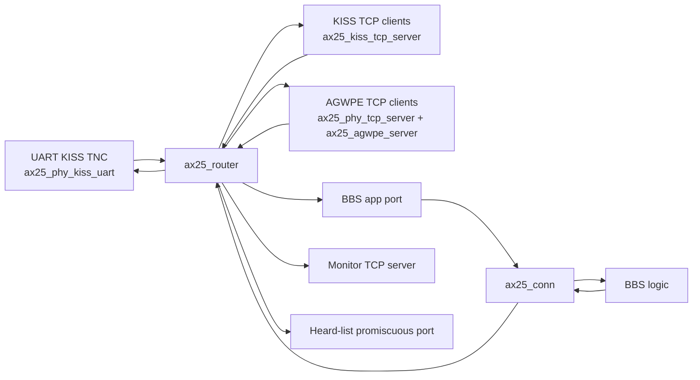

# esp-ax25 Components Used By esp-tnc

This note summarizes the main `esp-ax25` modules that the `esp-tnc` app uses
today, based on the current code in `main/main.c`, `main/bbs.c`,
`main/bbs.h`, and `main/bbs_heard.c`.

Scope notes:

- This describes the main `esp-tnc` application, not `test_bbs`.
- "Directly used" means `esp-tnc` includes or calls the module explicitly.
- Some `esp-ax25` files are support layers used indirectly by the direct
  modules below.

## Main Directly Used Modules

| Module | Role in esp-tnc |
| --- | --- |
| `ax25_config` | Runtime configuration system. `esp-tnc` initializes it first and adds local `bbs.*` and `uart.*` schema keys. |
| `ax25_wifi` | Starts Wi-Fi in STA/AP mode before the TCP-based services come up. |
| `ax25_router` | Central AX.25 frame router that connects UART, KISS TCP clients, AGWPE, monitor, heard-list capture, and the BBS application port. |
| `ax25_conn` | Connected-mode AX.25 session used by the BBS. |
| `ax25_phy_kiss_uart` | UART KISS transport for the attached serial TNC, and also the UART passthrough path used by `TERM` mode. |
| `ax25_kiss_tcp_server` | KISS-over-TCP server that maps each client connection to a router port. |
| `ax25_phy_tcp_server` | Generic TCP server wrapper used for the AGWPE listener. |
| `ax25_agwpe` and `ax25_agwpe_server` | AGWPE client/session handling for external packet applications. |
| `ax25_monitor_tcp_server` | TCP monitor output service, started only when the local menuconfig option is enabled. |
| `ax25_log_tcp_server` | TCP log streaming service, started only when the local menuconfig option is enabled; its default follows PSRAM availability. |
| `ax25_beacon` | Periodic beacon transmission service, started only when the local menuconfig option is enabled. |
| `ax25_digipeater` | Optional digipeater started only when both the local menuconfig option is enabled and `digi.callsign` is configured. |
| `ax25_address` | Callsign/address parsing and formatting utilities used throughout startup and session logging. |
| `ax25_frame` | Shared frame structure used across router, transports, and connection handling. |

## Startup Order In esp-tnc

The high-level startup sequence in `app_main()` is:

1. Initialize NVS.
2. Initialize `ax25_config` with the local `bbs.*` and `uart.*` schema.
3. Read important config values such as `bbs.callsign`, `bbs.sysop_secret`, and transport limits.
4. Start `ax25_wifi`.
5. Start `ax25_log_tcp_server` if enabled in local menuconfig.
6. Initialize `ax25_router`.
7. Initialize AGWPE server manager support.
8. Initialize `ax25_beacon` if enabled in local menuconfig.
9. Initialize UART transport with `ax25_phy_kiss_uart` if UART is enabled.
10. Optionally initialize `ax25_digipeater` if enabled in local menuconfig and `digi.callsign` is set.
11. Start `ax25_kiss_tcp_server`.
12. Start `ax25_monitor_tcp_server` if enabled in local menuconfig.
13. Start the AGWPE TCP server with `ax25_phy_tcp_server`.
14. Initialize BBS storage and heard-list tracking.
15. Register the BBS application port with `ax25_router`.
16. Initialize the BBS AX.25 connected session with `ax25_conn`.
17. Initialize the BBS application state.
18. Start the BBS worker task.

## Data Flow

The active data path is organized around the router.

### What this means operationally

- The UART-attached TNC is one router port when `uart.type=kiss`.
- Each KISS TCP client gets its own dynamic router port.
- The BBS is not a raw transport. It sits behind a static router port and an
  `ax25_conn` session.
- The heard-list tracker registers a promiscuous router port so it can observe
  traffic without owning a destination.
- In `TERM` mode, the UART is still initialized, but the KISS decoder path is
  bypassed and BBS terminal mode uses the UART raw/tap APIs instead of normal
  routed frame handling.

## Direct Module Responsibilities

### Configuration and bootstrapping

- `ax25_config` provides the runtime schema, staged config changes, save/
  commit/revert behavior, and the config command handler used by the BBS.
- `ax25_wifi` applies Wi-Fi STA/AP runtime settings and brings up networking.

### Transport-facing modules

- `ax25_phy_kiss_uart` handles framed KISS UART I/O and raw UART access used by
  terminal mode.
- `ax25_kiss_tcp_server` exposes KISS over TCP and binds each client to a
  router port.
- `ax25_phy_tcp_server` is the lower-level TCP listener used for the AGWPE
  service.
- `ax25_agwpe` and `ax25_agwpe_server` translate between AGWPE client traffic
  and AX.25/router traffic.

### AX.25 core path

- `ax25_router` moves frames among the active ports.
- `ax25_conn` implements the connected-mode session used by the BBS.
- `ax25_address` and `ax25_frame` provide common address and frame structures.

### Auxiliary services

- `ax25_beacon` sends periodic beacons when enabled in menuconfig and configured at runtime.
- `ax25_digipeater` retransmits frames when enabled in menuconfig and configured at runtime.
- `ax25_monitor_tcp_server` exports monitor traffic when enabled in menuconfig.
- `ax25_log_tcp_server` exports logging when enabled in menuconfig; by default this is off on builds without PSRAM.

## esp-ax25 Modules Present But Not Directly Used By The Main esp-tnc App

These modules exist in the `esp-ax25` component tree, but the main `esp-tnc`
application does not directly include or initialize them:

- `ax25_phy_kiss_bt`
  Bluetooth KISS transport is present in the component, but not wired into the
  current `esp-tnc` app.
- `ax25_phy_kiss_tcp_client`
  Used by `test_bbs`, not by the main `esp-tnc` runtime.

## Support Modules Likely Used Indirectly

These are part of `esp-ax25`, but they are mostly internal support pieces for
the direct modules above rather than app-level integration points:

- `ax25_buffer`
- `ax25_conn_dispatcher`
- `ax25_config_defaults`
- `ax25_kiss`
- `ax25_log`
- `ax25_print`
- `ax25_uart`

## Local Menuconfig Options

The app also exposes a small set of local build-time options under
`ESP-TNC BBS` in `menuconfig` via `main/Kconfig.projbuild`.

- `Enable AX.25 log TCP server`
  Compile-time gate for `ax25_log_tcp_server`. The default is `y` when PSRAM
  is enabled and `n` when PSRAM is not enabled.
- `Enable AX.25 monitor TCP server`
  Compile-time gate for `ax25_monitor_tcp_server`.
- `Enable AX.25 beacon service`
  Compile-time gate for `ax25_beacon`.
- `Enable AX.25 digipeater service`
  Compile-time gate for `ax25_digipeater`.
- `SYSOP Name`, prompt text, greeting text, version text, storage limits, and
  SYSOP authentication settings
  App-local BBS defaults that shape the command interface and storage/auth
  policy, separate from the runtime `ax25_config` schema.

These menuconfig options complement the runtime `bbs.*`, `wifi.*`, `net.*`,
and `uart.*` values stored through `ax25_config`. If a service is disabled in
menuconfig, the corresponding module is compiled in but not started by the app.

## Quick Summary

At a high level, `esp-tnc` uses `esp-ax25` as four layers:

1. Configuration and Wi-Fi bring-up.
2. Transport services for UART KISS, KISS TCP, AGWPE, monitor, and logs.
3. The AX.25 core router plus connected-mode session handling.
4. Optional network services such as beacons and digipeating.

The BBS itself is the application sitting on top of that stack, with `ax25_conn`
providing the connected session and `ax25_router` providing the shared traffic
backplane.